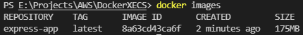
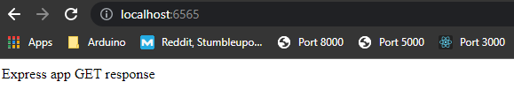
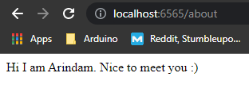
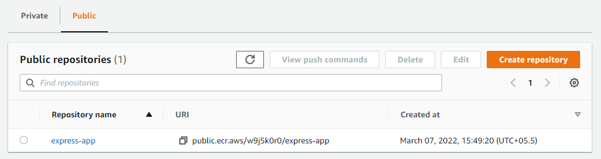
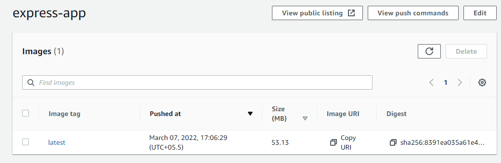
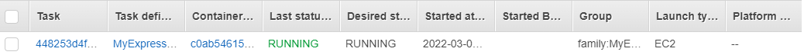
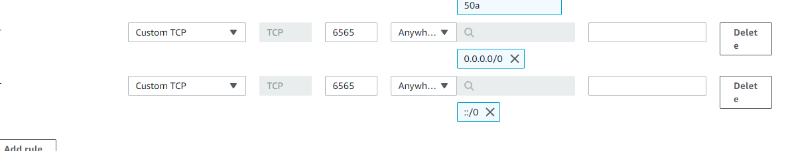

> Objective: To deploy a docker app to Amazon ECS

Prerequisites:

1. [Set-up AWS CLI](https://docs.aws.amazon.com/polly/latest/dg/setup-aws-cli.html)
2. Set up Docker Desktop

Steps:

1. Setting up the code: The application that we are deploying is made using Express, so make an index.js file with some sample code. Make sure that you have installed express using `npm install express`

2. Dockerizing the application: Steps have been specified in the comments of the Dockerfile
    - After making the dockerfile, go to your terminal and write the command `docker build -t express-app .`. This will build the docker file in the directory
    - run `docker images` and see the output, it should look something like this:

     

    - Note down yout Image ID which will look something like "b7fe7e253a5d"
    - To run the container, run `docker run -p 6565:5000 <IMAGE ID>` (this will run the container on port 6565 on our local machine. You can set the port on your own)
    
    E.g., I will run `docker run -p 6565:5000 b7fe7e253a5d`

    Output on default endpoint:

    

    Output on /about endpoint:

    

    > With that, the application is now running on our local machine

3. Creating a repository with Elasic Container Registry (ECR)
    #### The task now is to get our image into AWS
    - Go to AWS Management Console, search for and go to ECS (Elastic Container Service)
    - Go to Amazom ECR by clicking on "Repositories". This is where we register our images. Click on 'Create Repository' button
        - Set Visibility to 'Public' for this tutorial. This is so that we can avoid setting IAM rules for now.
        - Give your repository a name of your choice
        - Leave the rest of the settings as they are and click on "Create repository"

        

    - Now, we need to build our Docker image and push it into the "express-app" repository
        - Click on your repository, click on "View push commands"
        - You will see a set of commands, run them one by one.
        - After the last command is done running, you should be able to see the Image in your AWS Console.

        

        > Now, our image has been pushed to the repo, very similar to how we do it on Docker Hub.

4. To run our application, we need a server and some networking, and we will start doing that by setting up a Cluster
    - This cluster will basically be an EC2 instance, that will be our server where our application will run
    - On AWS Manageent Console, in ECS service, Click on Clusters, Create Cluster
    - Choose "EC2 Linux + Networking", Next Step
    - Give your cluster a name
    - Choose t2.micro EC2 instance for now
    - In Networking section, choose default VPC. Pick the first subnet
    - Auto-assign public IP: Enabled
    - Choose default security group
    - Create Cluster

    > This should create your Cluster. You can confirm this by going to your EC2 console. You will find a new instance there.

5. Next, we need to run a Task
    - Go to Task Definitions. Here, we are expected to specify how much CPU power, memory etc. do we need. Follow the steps given below:
        - Create Task Definition
        - EC2, Next Step
        - Give Task definition name
        - In Task Size section, give memory `100` MiB and Task CPU as `1 vCPU` (this will be deleted at the end of this experiment)
        - Add container
        - Give container name, paste Image repository URI in the relevant sections
        - Port Mappings: Host port->6565, Container port->5000
        - Click on Add
        - Create task

    - Go to your app's cluster-> Task-> Run New Task -> Launch type: EC2 -> Run

    

6. Go to EC2 instances, open your instance's details
    - Copy Public IPv4 address
    - Paste it in the browser
    - Add 6565 to suffix of URL, hit Enter. THIS WILL NOT WORK as we have not exposed the port to the security groups
    - Note the security group that your instance is using
    - Go to security groups, edit the inbound rules. Add 2 new rules as such:

    

    - Go back and refresh your applicatoin. It is now deployed

