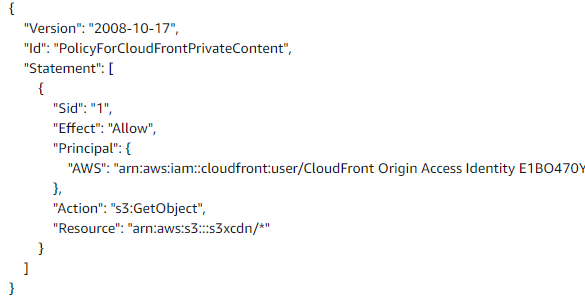
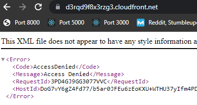
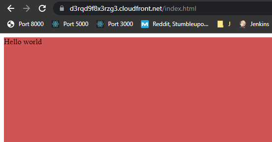
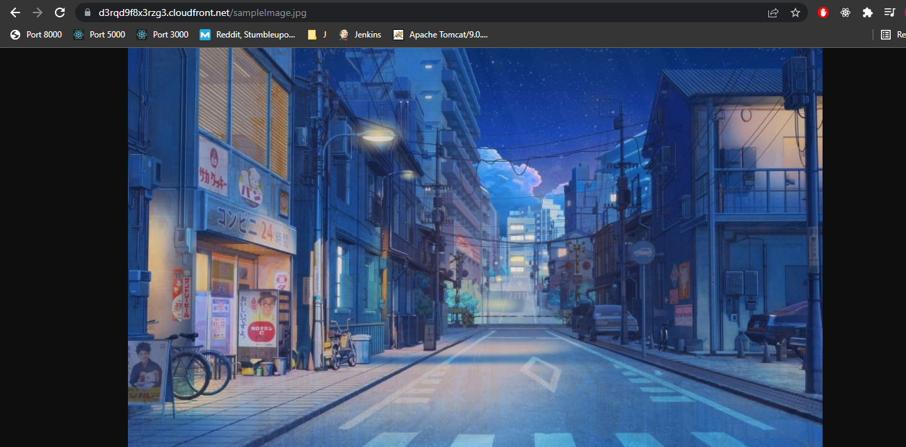

### Objective: Deploy front end application on S3 which would be accessible only through CDN. 

Steps:

1. Create S3 Bucket
    - Make sure that the option to block all public access is checked
    - Upload a sample html file (like index.html), a css file (styles.css), and an image in this folder. 
2. Create CloudFront distribution
    - Go to AWS' CloudFront service
    - Create Distribution
    - Origin domain -> Choose your S3 bucket
    - In S3 bucket access section, choose "Yes use OAI" 
        - Create new OAI
        - Keep the name
        - Choose "Yes, update the bucket policy" in Bucket policy section

    - In default cache behavior section, Choose "Redirect HTTP to HTTPS" 
    - Leave the remaining settings as default, click on Create Distribution. It will take some time to deploy.
    - You can view your OAI on the CloudFront dashboard, under the Security section
    - To verify whether OAI read-only permissions have been set in the S3 bucket, so to "Permissions" inside your bucket. You should see this permission enabled:
    
3. Verify
    - Get the domain name from your cloudfront distribution
    - If you try to go to the domain, it will give the following message:
    
    - But if you try to access an object, like an html file inside the bucket, you will be able to view it
    
    - Same goes for an image
     
    - Try adding this image inside the .html file and view the document. It should be visible

