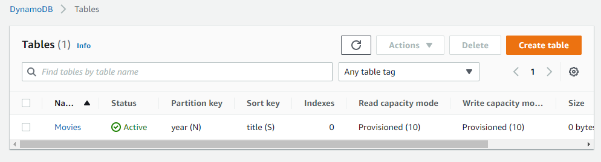
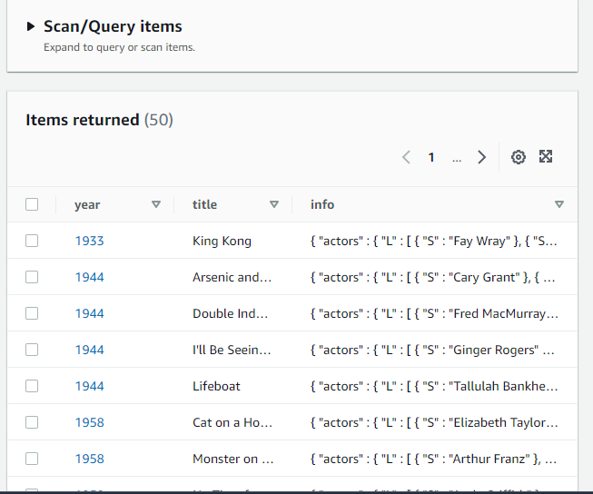
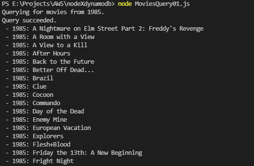

Docs: [Getting Started with Node.js and DynamoDB](https://docs.aws.amazon.com/amazondynamodb/latest/developerguide/GettingStarted.NodeJs.html)

Objective: CRUD operations using Node.js and DynamoDB (via AWS SDK)
 

Prerequisites:
- Set-up Node.js
- npm install aws-sdk

- Set up an AWS access key to use the AWS SDKs. [Setting Up DynamoDB (Web Service)](https://docs.aws.amazon.com/amazondynamodb/latest/developerguide/SettingUp.DynamoWebService.html)

- Set up the AWS SDK for JavaScript:
    - Install Node.js.
    - Install the [AWS SDK for JavaScript](https://aws.amazon.com/sdk-for-javascript/).

> Steps

1. [Create a Table with in DynamoDB with AWS SDK for JavaScript](https://docs.aws.amazon.com/amazondynamodb/latest/developerguide/GettingStarted.NodeJs.01.html)
(Here, I have used environment variables to store credentials)

Result:

2. [Load Sample Data](https://docs.aws.amazon.com/amazondynamodb/latest/developerguide/GettingStarted.NodeJs.02.html)

Result: 

3. [CRUD](https://docs.aws.amazon.com/amazondynamodb/latest/developerguide/GettingStarted.NodeJs.03.html)

4. [Query and Scan Data with AWS SDK for JavaScript in DynamoDB](https://docs.aws.amazon.com/amazondynamodb/latest/developerguide/GettingStarted.NodeJs.04.html)
Result

To avoid costs, I have not performed the other queries, as the database is quite large

Feel free to visit the link and perform the rest yourselves

> After you are done experimenting, cleanup, i.e. [delete the table](https://docs.aws.amazon.com/amazondynamodb/latest/developerguide/GettingStarted.NodeJs.05.html) to avoid unnecessary costs