> Prerequisites:
1. AWS Account
2. AWS Access Keys
3. Knowledge of EC2 instances

> Steps:
1. Terraform overview | Launch EC2 Instance 
    - Create a file: "main.tf"
    - Define a "provider", which is a plug-in that allows us to interact with APIs. Learn more about the list of providers available [here](https://registry.terraform.io/browse/providers).
    - Go to the link in the previous line and select AWS, which is what we will be working with.
    - Check out the example code in the docs, which is what you will find in `main.tf` as well.
    - Now, set-up authentication
        - The wrong way: hard-code the AWS Access keys in the `provider` section. You may try this for the experiment but be sure that you do not committ your code to a public repository. We will follow this for now.
        - The correct way: Make a `terraform.tfvars` file.
    - Time to provision some resources
        - Syntax:
            ```
                resource "<provider>_<resource_type>" "name"{
                    key = "value1"
                    key2= "value2"
                    ...
                }
            ```
        - The "name" is not set in AWS. It is used for reference in terraform.
        - Launch an EC2 instance. Refer to (this link)[https://registry.terraform.io/providers/hashicorp/aws/latest/docs/resources/instance] for syntax.
        - AMI used for this activity: 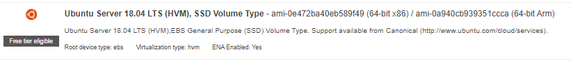
        - Copy the AMI ID from your AWS account and paste it in the syntax as shown in `main.tf` file
        - Next, open the terminal in your current directory and run `terraform init`, which will look at our config in the `.tf` files and look for providers and download the necessary plugins.

        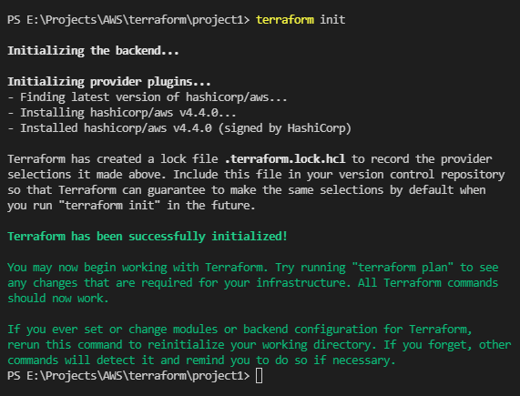

        - Run `terraform plan`, which reads/compares the current state of any already-existing remote objects to make sure that the Terraform state is up-to-date. Otherwise it shows the changes needed to get to the desired infrastructure. It should show the following at the end of your output:
        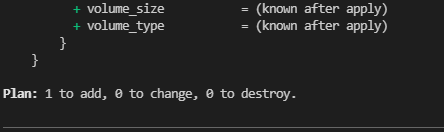

        - To actually run the code, run `terraform apply`. Enter yes when prompted
        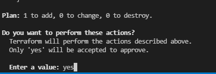

        The launch should be complete. Go to your AWS Console to confirm this.
        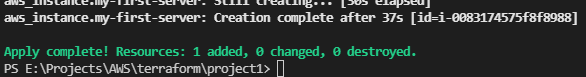
        

        
2. Modifying resources
    -  If you would run `terraform plan` and `terraform apply` again, it will detect that there is no difference in the required configuration
        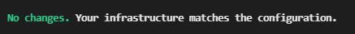

    - Try changing the "Name" tag and run `terraform plan`,  `terraform apply` again. You do not need to run `plan`, but it is considered good practice. After doing so, check EC2 console to see if the change has been made

        

3. Deleting resources
    - To destroy instances, we can run the command `terraform destroy`. This will delete the instance that we made previously, and everything associated with it after we enter "yes", when prompted.

    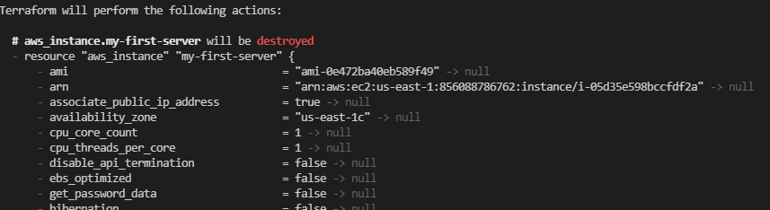

    - Go to your AWS Console to confirm this

    - To delete a particular resource, just comment out the piece of code (or remove it altogether) that is used to launch it and run `terraform apply` again. This is the advantage of Terraform havinga declarative nature

4. Referencing resources
    - Now that we have seen how to creat an instance, let's work with VPCs and subnets
    - Find terraform docs for aws_vpc [here](https://registry.terraform.io/providers/hashicorp/aws/latest/docs/resources/vpc)
    - Create a VPC in the same manner as given in the main.tf file 
    - To create a subnet, refer to the [documentation](https://registry.terraform.io/providers/hashicorp/aws/latest/docs/resources/subnet) in a similar manner
    - Notice that we have not deployed the VPC yet so we do not have its ID, which needs to be specified in the subnet, so to solve this terraform allows us to reference resources as done in `main.tf` file
    - Run `terraform plan`, then `terraform apply` to launch it. Confirm this on your AWS Console
    - The order in which we define the resources does not matter, terraform will launch the VPC before the subnet. You can check this in the output of the `terraform apply` command. Terraform knows that the VPC needs to be created first.

5. Terraform files
    - You may have noticed the extra files that were created in your project directory
    - The `.terraform` folder was initialised with the `terraform init` command. It contains the files necessary to launch the resources via the required provider. You can test this by deleting the folder and trying to run `terraform apply`, which will throw an error.
    - `terraform.tfstate` represents all the states for our terraform config. This is used to compare the changes, Try creating another VPC with a subnet and look for changes in the `terraform.tfstate` file.

_______________________
> Project

### Objective: Deploy a WEB SERVER (Deploy an EC2 instance on a custom VPC, on a custom subnet, assign it a public IP address, establish a SSH connection, and handle web traffic using web servers)


Prerequisites:
- [Create a Key-Pair on AWS](https://us-east-1.console.aws.amazon.com/ec2/v2/home?region=us-east-1#KeyPairs:), download it. I have used a .pem file format for this example

#### Steps

1. Create VPC
    - 
2. Create Internet Gateway
    - Used to send traffic out to the internet and use a public IP Address
3. Create custom route table
4. Create a subnet
5. Associate subnet with route table
6. Allow ports 22, 80, 443 using Security Groups
7. Create network interface with an IP in the previously created subnet
8. Assign Elastic IP to the network interface
    - EIP depends on IGW
9. Create Ubuntu server and install/enable apache2
    - It is important to specify the availability zone, which should be the same as the subnet (created in step 4), otherwise trying to launch the instance may cause an error

- After completing the steps, run `terraform`

- Feel free to review and confirm everything on the AWS Console
- After the EC2 instance has been initialized, try going to its public IP Address

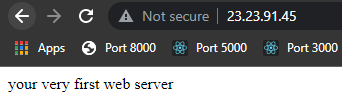

10. Bonus: Connect to the server using SSH client

- Now, we will try to connect to the IP address using SSH
- Download (PuTTY)[https://www.chiark.greenend.org.uk/~sgtatham/putty/latest.html]
- Install it and search for it in your device. The search result will also show "puTTYgen". Click on it.
- Similar to the .pem file that we downloaded as a key-pair, puTTY uses .ppk files to establish connection. puTTYgen enables us to convert our .pem file to .ppk
- In puTTYgen, click "Load"
- Enable "All files" option
- Choose your key
- Save private key. Close window.
- Open puTTY
- Go to your instance and hit "Connect", select "SSH Client" tab. See the instructions.
- 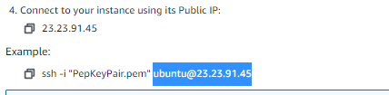
- Copy this part and paste it in "Host Name" section on PuTTY.
- Inside Connection tab, click on SSH Option-> Auth -> Select your file in "Private key file for authentication" -> Open. This should open up a terminal.
- Wait for a message to pop-up. Click "accept".
- After it loads, try running the `systemctl status apache2` command. You should see the subsequent output

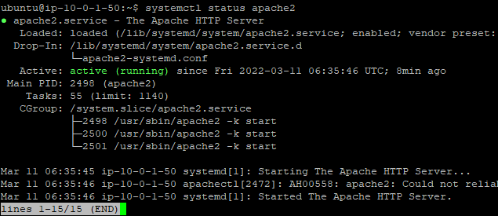

- We have successfully started the server using the SSH client (puTTY), which was the objective.
- Make sure that you destroy the resources after you are done to prevent any unnecessary charges.

---
> Terraform state commands
- You may want to deploy some resources for this e.g. the resources that you had launched in the project
- `terraform`: Gives list of commands
- `terraform state`: List of state commands
- `terraform state list`: Gives list of resources that we have created
- `terraform state show <resource name>`: Gives details of the resource
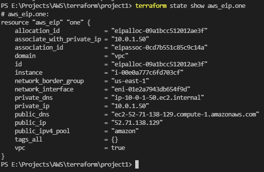
---
> Terraform output
- Instead of writing commands everytime we want to see some necessary details, we can just print them as output when we launch the resources using `terraform apply`
- E.g. We want to print the public IP, private IP, and the server ID, we can do so by following the snippet in the main.tf file and running `terraform apply` again.

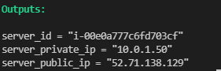

- We can verify these outputs using `terraform output` command
---
> Target resources
- We can delete individual resources as well, instead of destroying the infrastructure completely, say, we wish to delete the EC2 instance, we can look up the exact resource name and delete it in the following format:
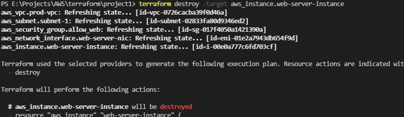

- To do the opposite i.e. launch this particular resource, run `terraform apply -target aws_instance.web-server-instance`
 where `aws_instance.web-server-instance` is the resource name
---
> Terraform Variables
- We can store values inside variables, just like any other language. Check out the (docs)[https://www.terraform.io/language/values/variables] and try to make sense of the example in the main.tf file
- On applying, you will notice that the CLI asks us for an input for the variable that we have specified
- Another way of doing so is by using the (`-var`)[https://www.terraform.io/language/values/variables#variables-on-the-command-line] flag
- Most common way to assign variables is to use a separate file (terraform.tfvars) to store them. I will be using this to store by access keys. You can check the syntax for it in the `terraform.tfvars.example` file. 
The "subnet_prefix" variable is being used as array of objects in this example.

- You can change the file name and use `terraform apply -var-file="<filename>.tfvars"` to tell terraform about the variables

- So we define the variable in the `main.tf` file but we specify the value in the `terraform.tfvars` file